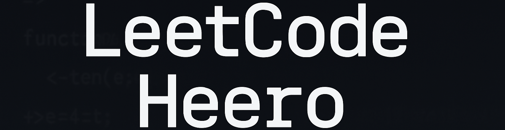

# LeetCode Heero

### Table of Contents
- [Content Goes Here](#content-goes-here)
    - [More Stuff](#more-stuff)

## <a name="content-goes-here">Content Goes Here</a>

### <a name="more-stuff>More Stuff</a>
Grind 75 projects.
The idea is to make steady progress with LeetCode using GitHub as a motivational tool.

TODO
Learn to write better README files
Add previously tested LeetCode challenges
Sections related to data structures and concepts with links to relevant files
