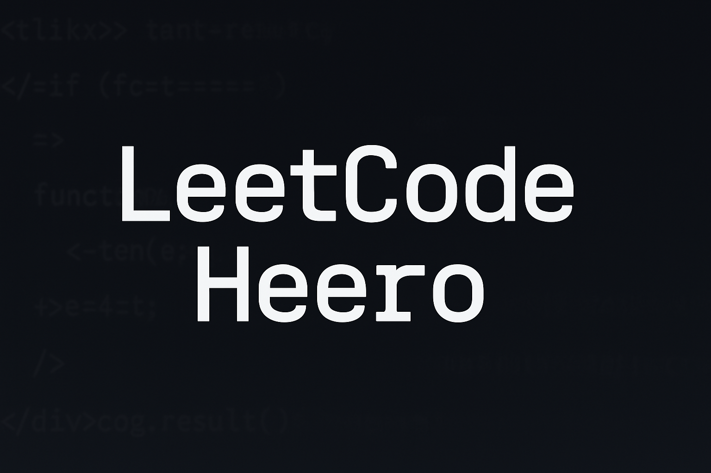

Grind 75 projects.
The idea is to make steady progress with LeetCode using GitHub as a motivational tool.

TODO
Learn to write better README files
Add previously tested LeetCode challenges
Sections related to data structures and concepts with links to relevant files
